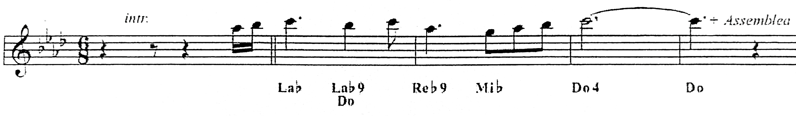

<h1 style="margin-bottom:0;">Agnello di Dio</h1>
Tommaso Bailo, Renato Giorgi
  

**Sol# Re# Do# Do/Mi**

**&ensp;Sol# Sol#/Do Re#/Do# Do#**
Agne - llo &emsp; di Di - - - - - o,
**&emsp; &ensp;Si#- &emsp;&ensp; Do# &emsp;&ensp; Re#**
che togli i peccati del mondo,
**Sol# Do-&ensp; Do# &ensp; &emsp; Do7 Do**
a - - - bbi &ensp; pietà &ensp;di noi.

**&ensp;Sol# Sol#/Do Re#/Do# Do#**
Agne - llo &emsp; di Di - - - - - o,
**&emsp; &ensp;Si#- &emsp;&ensp; Do# &emsp;&ensp; Re#**
che togli i peccati del mondo,
**Sol# Do7/Sol&ensp; &emsp; Fam&ensp;Do7 Do**
a - - - bbi &emsp; &emsp; pietà &ensp;di noi.

**&ensp;Sol# Sol#/Do Re#/Do# Do#**
Agne - llo &emsp; di Di - - - - - o,
**&emsp; &ensp;Si#- &emsp;&ensp; Fa- &emsp;&ensp; Re#**
che togli i peccati del mondo,
**Sol# Do-&ensp; Do# &ensp; &emsp;&emsp;&emsp; Fa**
do\--\--na a noi la pace, la pace...