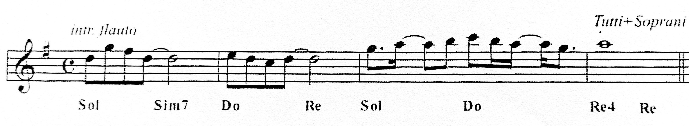

<h1 style="margin-bottom:0;">Santo</h1>
Tommaso Bailo, Renato Giorgi
  

**Sol Si-/Re Do Re Sol(Fondamentale) La- Si- Do Re**

**Sol  Si-/Re Do Re**
Sa\--nto &emsp; Sa-nto
**Si &ensp;Mi- &emsp;&ensp; Do &ensp;La/Do# &ensp;Re4 Re**
Sa\--nto, il Signore Dio dell'Unive - - rso

**&ensp;La- &emsp; Mi- &emsp;  Si/Re# Mi-**
I Cieli e la terra Sono pieni di &ensp; te
**La- &ensp;Do/Sol Sol &ensp;Re &ensp; Do Re Re**
della tua &emsp;glo - ria

#### Ritornello: 
**Do Sol**
Osanna 
**Si &nbsp; Mi-**
Osanna
**&emsp;&emsp;La- &emsp;La-/Do   Sol/Re Re**
Osanna nell'alto dei cie - - -  li
**Do Sol**
Osanna 
**Si &nbsp; Mi-**
Osanna
**&emsp;&emsp;La- &emsp;La-/Do&ensp;Re&ensp;Do**
Osanna nell'alto dei cie\--li

 

**Sol &emsp; Si-/Re&emsp;Do  &emsp; Re**
E benedetto colui che viene
**Mi-&emsp;Do &emsp; &emsp; Sol &emsp;Re**
Ne\--l nome del Signo-re

**La- &emsp; Mi-&emsp;&emsp;Si-  &emsp; Do**
E benedetto colui che viene
**&ensp; &emsp; Mi-&emsp; (Do) Sol Re &ensp; Do Re Re**
Nel nome dell'Altissimo

**Ritornello x1**